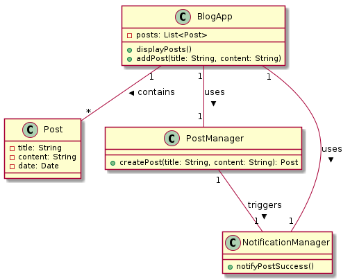
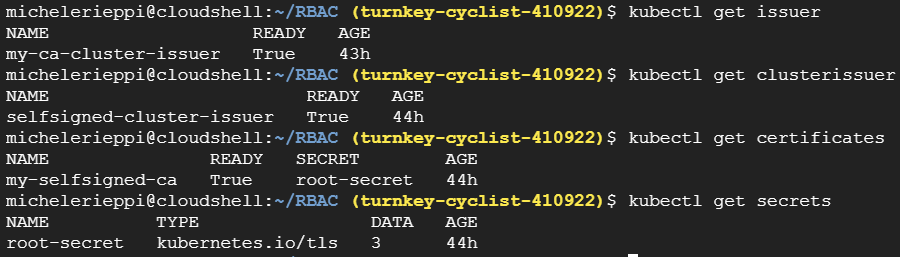
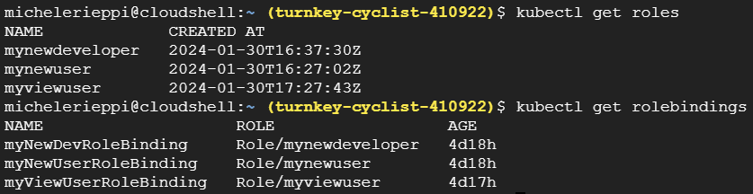

# software_containerization
Containerization Assignment
Create an application with the following components:

1. Relational or non-relational database with suitable configuration (such as a custom schema for a relational database).

2. REST API that can read and write to the database (at least 1 GET to read content and one POST method to create content).

3. Web front end that interacts with the database via the REST API.

For the Database, you can reuse an existing database image.

Create Dockerfiles to containerize the REST API and the Web front end.

Create Kubernetes YAML files or a single Helm chart that generate three deployments/statefulsets as appropriate for deploying the three components to a Kubernetes cluster.

Create additional configuration artifacts as described in the Rubric below.

Submit a zip file containing:

1. The source code of your project. Note: the sources are mandatory because we need to ensure that we look at the source files as they were at the time of the submission. Sources include: the application, the Dockerfiles, the Kubernetes YAML files and/or the Kubernetes Helm Charts.

2. The URL of the GitHub repository where the source code is hosted. If the project is private, add the teacher to the repository.

I will look at the project in GitHub just to check who committed what in case there is a doubt about a team member's actual contribution.

3. A README with the instructions to run all the commands that you will show in the presentation.

## Yuhang(Viktor) Wu's Part:

Personal Information:
| Student Email       | Legal Name       | GitHub Username |
|---------------------|------------------|-----------------|
| y.wu14@student.vu.nl| Yuhang Wu        | usher233         |

### WebUI


The website of our project is a simple blog application where users can create and read posts. The website is built using React.js. Hosted on Ngnix, the website is a single page application. Dockerfile is used to containerize the website.

When click on the "Create Post" button, the input form will show up. After filling in the title and content of the post, click on the "Submit" button to create a new post. The new post will be posted to the api and then stored in the database. The posts will then be displayed on the website. At the same time, a notification will show up at the middle of the screen to indicate that the post has been successfully created.

To build the webui image and push it to hub registry, run the following command in the blog-react directory:

```bash
docker build -t <your_hub_username>/webui:<ver> .
docker push <your_hub_username>/webui:<ver>
```

In this case, the hub username is "viktorwu" and the version number is "v1" and "v2" for two different versions of the applications. You can find the Docker Hub repository for the web UI image at [viktorwu/webui](https://hub.docker.com/repository/docker/viktorwu/webui).

### Artifacts Registry and GKE

I also pushed the images of the webui, api and database to the artifact registry on GCP. The images are then used to deploy on the GKE.

### Helm Charts on GKE

After my teammate finished the api and database part, I created the Helm Charts for the whole project. The Helm Charts are used to deploy the whole project to GKE. Only the WebUI related yaml files are dynamical because:

1. Those of the api and database are already finished and can be reused
directly in the template.
2. I only perform canary/rollout update on the webui part.
To create, install, update and uninstall the Helm Charts, run the following commands:

```bash
helm create blog-react
helm install blog-react blog-react
helm upgrade blog-react blog-react
helm uninstall blog-react
```

Two main points to note in the Helm Charts are:

1. How to scale the application horizontally (stateless parts only)?

For this project, the webui is the only stateless part. Of course, to scale the webui, we can simply change the replicaCount in the values.yaml file. The deployment.yaml file in the templates folder will then be updated to reflect the change:

```yaml
replicaCount: 3 # The number of replicas, in values.yaml
```

```yaml
# deployment.yaml
spec:
  {{- if not .Values.autoscaling.enabled }}
  replicas: {{ .Values.replicaCount }}
  {{- end }}
```

However, we usually don't want to manually change the replicaCount every time we want to scale the webui. We can use the autoscaler to automatically scale the webui when needed. To enable the autoscaler, set the enabled field to true in the values.yaml file, and set the parameters for the autoscaler:

```yaml
# values.yaml
autoscaling:
  enabled: true
  minReplicas: 1
  maxReplicas: 100
  targetCPUUtilizationPercentage: 80
  targetMemoryUtilizationPercentage: 80
  ```
  
  The template for Helm Charts has a predefined hpa.yaml file in the templates folder. So we don't need to create a new one. The hpa.yaml file will be updated to reflect the changes in the values.yaml.

 2. How to perform a update?

To perform a update, we need to change the image tag in the values.yaml file. The deployment.yaml file in the templates folder will then be updated to reflect the change. It's easy to perform a rollout update with Helm Charts because Helm Charts support the rollingUpdate strategy by default. The rollingUpdate strategy is defined in the values.yaml file:

```yaml
# strategy of values.yaml for deployment rollout
strategy:
    type: RollingUpdate
    rollingUpdate:
      maxUnavailable: 1
      maxSurge: 1
```

For Canary update, it involves managing two different sets of configurations: one for the stable version of your application and another for the canary version. So we need to create a new deployment.yaml file in the templates folder. And define how many replicas for the stable version and the canary version in the values.yaml file:

```yaml
# values.yaml
stable:
  replicas: 5
  imageTag: "v2"

canary:
  replicas: 1
  imageTag: "v1"
```

```yaml
apiVersion: apps/v1
kind: Deployment
metadata:
  name: {{ .Release.Name }}-stable
spec:
  replicas: {{ .Values.stable.replicas }}
  template:
    containers:
    - name: app
      image: "myapp:{{ .Values.stable.imageTag }}"

---
apiVersion: apps/v1
kind: Deployment
metadata:
  name: {{ .Release.Name }}-canary
spec:
  replicas: {{ .Values.canary.replicas }}
  template:
    containers:
    - name: app
      image: "myapp:{{ .Values.canary.imageTag }}"
```

## Michele Rieppi's Part:

Personal Information:
| Student Email         | Legal Name       | GitHub Username|
|-----------------------|------------------|----------------|
| m.rieppi@student.vu.nl| Michele Rieppi   | Riepp0         |

### Certificates



For the certificates part of the project, we've created a self-signed CA certificate and used it to sign the certificats for the webui. The yaml files have been created following the slides examples provided during the lectures. The certficates have been correctly applied to the cluster and the keys have been stored in a secret file stored in the /tls folder. 
Since we didn't have a domain name, we've used the IP address of the webui service as the common name for the certificate and we've tested the certificates on the localhost machine locally using microk8s.

### Network Policies


In the project we've organized our three different services (webui, api and database) in a way that allows each of them to communicate with the others. However, we want to make sure that the communication between the services is secure and that no unauthorized access is allowed. To do so, we've implemented network policies in our Kubernetes cluster.
In particular, as stated in the policies yaml files, we can see that the webui is allowed to communicate only with the webapi, the web api connects to both webui and db and the db is allowed to communicate only with the webapi.

To test the network policies, we can create a pod in the same namespace with the webui label and try to wget the webapi. We can see that the ping is successful. Then, we can try to wget the db and we can see that the ping fails. This can be done with the following commands

```bash
kubectl run test-pod --image=alpine -lapp=webui -it -- ash
/ # wget webapi:ip
```

### RBAC



In the project we've created 3 different users: developer, newuser and viewuser. The developer has a lot of priviledges and he can create, delete and modify a lot of resources in the cluster. The newuser has only the right to get watch and list the pods and the viewuser has only the right to view the pods. The users have been created generating self-signed certificates with openssl and then applying them to the cluster. The users permissions have been tested using the auth command as shwon below:
  
  ```bash
kubectl auth can-i delete pods --namespace default --as newuser
kubectl auth can-i delete pods --namespace default --as viewuser
kubectl auth can-i delete pods --namespace default --as developer
```